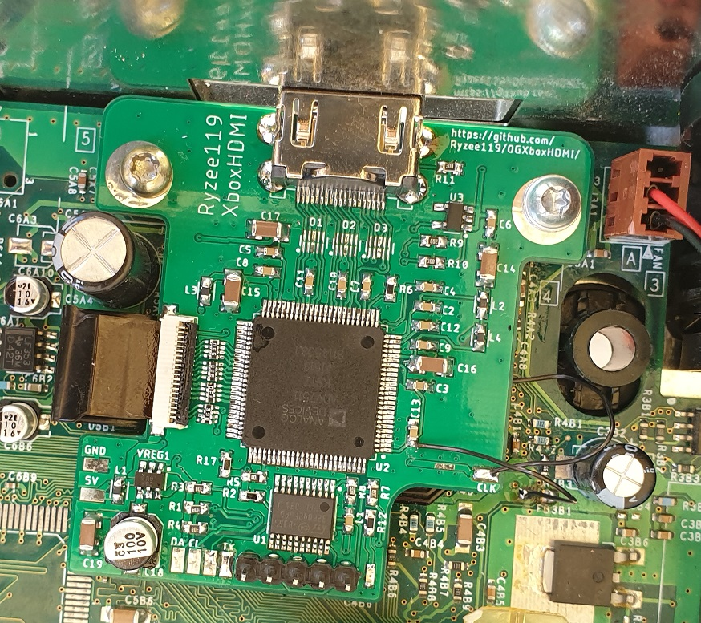

# Original Xbox 100% Digital HDMI (Prototype)

* A few HDMI captures taken from this board are here: https://imgur.com/a/OkmB1Vs
* This is a prototype 100% digital Original Xbox HDMI addon PCB. It taps into the GPU pixel bus before it enters the analog video encoder and converts it to a HDMI compliant signal.
* It has not been fully tested and may not work for you. Use at your own risk. This should only really be a starting point to make something better.
* SPDIF digital audio is tapped off the Xbox motherboard and is also encoded into the HDMI signal for the best possible audio quality.
* This is a prototype board which should work on all Xbox revisions however a new flex would need to be designed to accomodate v1.6 motherboards with an Xcalibur encoder.
* 480i does not work reliably. Use a force 480p BIOS.
* Currently the MakeMHZ solution is recommended. https://makemhz.com/products/xboxhd. It is a completely independent design which has been much more tested and with more features.

## Bill of materials
* See [Kitspace](https://kitspace.org/boards/github.com/ryzee119/XboxHDMI-Ryzee119/).
* Flatflex must be ordered separately. See [hardware](./hardware).

## Design Files
* Source code for the STM32F0 driver is [here](./src).
* Hardware design files are [here](./hardware).

## Programming
* Compile the code with [VSCode](https://code.visualstudio.com/) and the [platformIO](https://platformio.org/install/ide?install=vscode) plugin. It should automatically create the build sytem. Just click build.
* The STM32F07 driver must be programmed with the firmware.
* Programming is through the 5 pin SWD header on the PCB. Pinout from left to right: `+3V3, SWDCLK, GND, SWDIO, NRST`
* Some debug output is via the pad labelled `TX`. Baud 115200.

## Installation

* Photo may not match final PCB layout.

