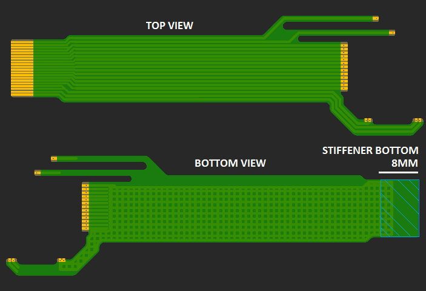

# Hardware

* This board was designed using [Autodesk Eagle](https://www.autodesk.com/products/eagle/overview). You can edit the `.brd` and `.sch` with this program.

## View Gerbers
* [XboxHDMI PCB](https://tracespace.io/view/?boardUrl=https://github.com/Ryzee119/XboxHDMI-Ryzee119/blob/master/hardware/gerbers_xboxhdmi.zip?raw=true)
* [FlatFlex PCB](https://tracespace.io/view/?boardUrl=https://github.com/Ryzee119/XboxHDMI-Ryzee119/blob/master/hardware/gerbers_conex_focus_flex.zip?raw=true)

### Flat Flex Properties
* 2 Layers
* Polyimide Flex
* FPC Thickness: 0.10 mm
* Stiffener: BOTTOM Plastic : 0.20 mm , BOTTOM Fr4 : 0 mm , BOTTOM Metal : 0 mm
* Total thickness at stiffener should be 0.30 mm.
* Stiffener location: See image 

